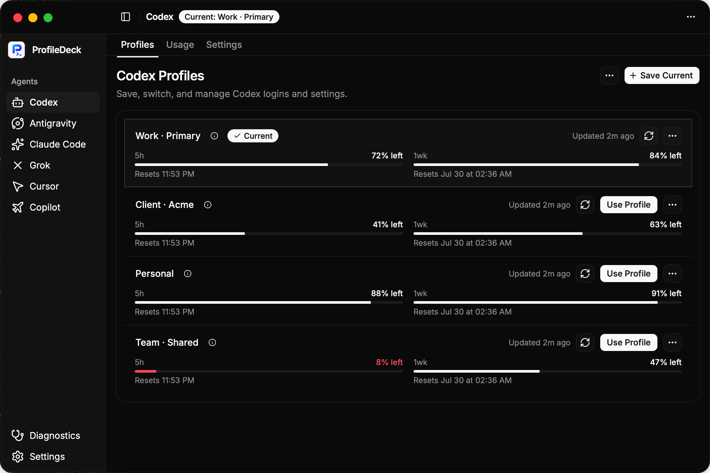

<div align="center">

# ProfileDeck

**Save and switch Profiles for AI Agents**

[](https://github.com/strahe/profiledeck/releases)
[](LICENSE)
[](docs/guide/getting-started.md)

[English](README.md) · [简体中文](README_ZH.md) | [Documentation](docs/index.md) · [Releases](https://github.com/strahe/profiledeck/releases)

</div>

ProfileDeck saves AI Agent logins and settings as reusable **Profiles**. Use the Desktop app or CLI to switch between Profiles and preview the changes before applying them.

## Features

- **Reusable Profiles** — Save separate logins and settings for work, personal, or other contexts.
- **Review before switching** — See which files and login details will change. Sensitive values stay hidden.
- **Usage and limits** — View usage data, cost estimates, and current limits; availability varies by tool.
- **Local data** — Keep data on your machine and create encrypted backups for recovery.

## Supported Agents

ProfileDeck supports multiple AI Agents. See [Agent support](docs/index.md#supported-tools) for the full list and what ProfileDeck can switch for each Agent.

## Install

| Option | Includes | Details |
| --- | --- | --- |
| **macOS app** | Desktop | [Download from Releases](https://github.com/strahe/profiledeck/releases) |
| **Linux DEB or RPM** | Desktop and CLI | [Install a Linux package](docs/guide/getting-started.md#deb-or-rpm-package) |
| **Linux portable app** | Desktop | [Install portable Desktop](docs/guide/getting-started.md#portable-desktop) |
| **Build from source** | CLI | [Build and use the CLI](docs/guide/getting-started.md#build-and-use-the-cli) |

## Desktop and CLI

Desktop and CLI use the same local Profiles and switching rules. Use Desktop for visual workflows and `profiledeck-cli` for terminal workflows and automation.

### Desktop

Manage Profiles, preview switches, view usage and limits, and run diagnostics from a visual interface.



### CLI

Use the CLI to list Profiles, switch between them, and view usage. The example below uses Codex:

```bash
profiledeck-cli codex profile list
profiledeck-cli switch codex <profile-id> --yes
profiledeck-cli usage summary --provider codex
```

Add `--json` when a script or tool needs machine-readable output. See the [CLI reference](docs/reference/cli.md) for all commands.

## License

[Apache License 2.0](LICENSE)
