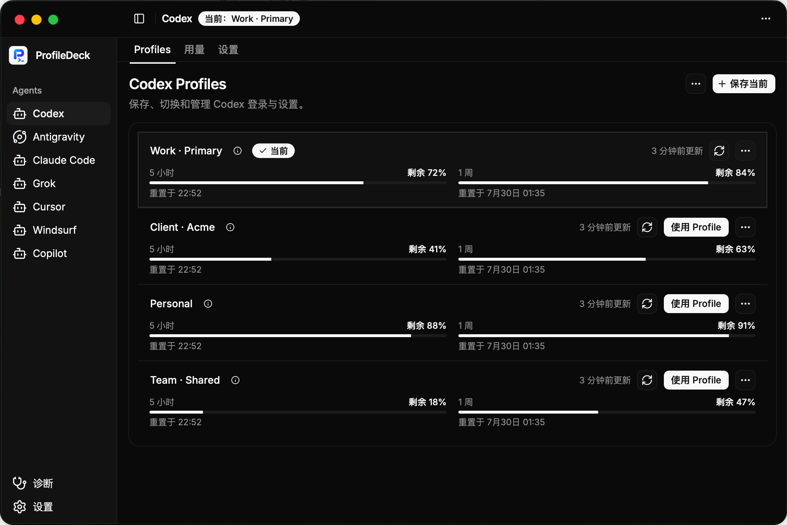

<div align="center">

# ProfileDeck

**保存并切换 AI Agent 的 Profile**

[](https://github.com/strahe/profiledeck/releases)
[](LICENSE)
[](docs/zh/guide/getting-started.md)

[English](README.md) · [简体中文](README_ZH.md) | [文档](docs/zh/index.md) · [发行版](https://github.com/strahe/profiledeck/releases)

</div>

ProfileDeck 将 AI Agent 的登录信息和设置保存为可复用的 **Profile**。你可以通过桌面端或 CLI 在不同 Profile 之间切换，并提前查看变更内容。

## 功能

- **Profile 管理** — 将不同的登录信息和设置分别保存为 Profile，按需切换。
- **切换预览** — 查看即将变更的文件和登录信息，敏感内容始终隐藏。
- **用量与限额** — 查看用量数据、成本估算和当前限额；支持情况因工具而异。
- **本地数据** — 数据保存在本机，并可创建加密备份用于恢复。

## 支持的 Agent

ProfileDeck 支持多种 AI Agent。完整列表及各 Agent 可切换的内容见[支持说明](docs/zh/index.md#支持的工具)。

## 安装

| 安装方式 | 包含内容 | 详情 |
| --- | --- | --- |
| **macOS 应用** | 桌面端 | [前往 Releases 下载](https://github.com/strahe/profiledeck/releases) |
| **Linux DEB 或 RPM** | 桌面端与 CLI | [安装 Linux 软件包](docs/zh/guide/getting-started.md#安装-deb-或-rpm) |
| **Linux 便携版** | 桌面端 | [安装便携版桌面端](docs/zh/guide/getting-started.md#便携版桌面端) |
| **源码构建** | CLI | [构建并使用 CLI](docs/zh/guide/getting-started.md#构建并使用-cli) |

## 桌面端与 CLI

桌面端提供可视化操作，`profiledeck-cli` 适合终端和自动化任务。两者共用本地 Profile 和切换规则。

### 桌面端

在桌面端管理 Profile、预览切换、查看用量与限额；遇到问题时，还可以运行诊断。



### CLI

使用 CLI 列出和切换 Profile，并查看用量。下面以 Codex 为例：

```bash
profiledeck-cli codex profile list
profiledeck-cli switch codex <profile-id> --yes
profiledeck-cli usage summary --provider codex
```

脚本或工具需要机器可读的结果时，可添加 `--json`。完整命令见 [CLI 参考](docs/zh/reference/cli.md)。

## 许可证

[Apache License 2.0](LICENSE)
